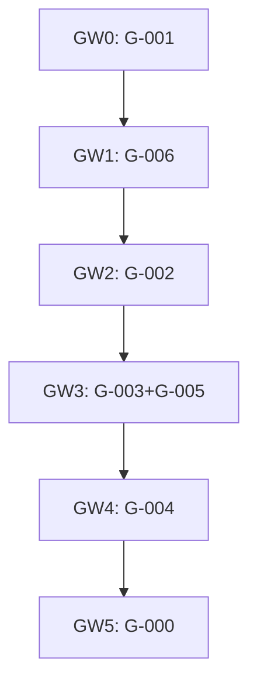
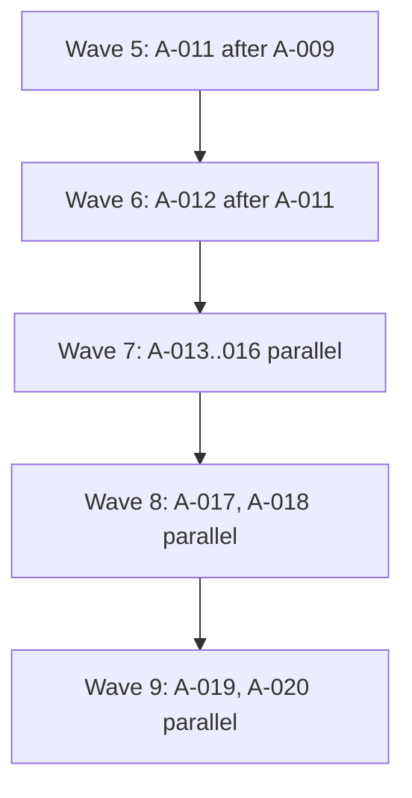

<!-- Author: Vasiliy Zdanovskiy, email: vasilyvz@gmail.com -->

# Marked Tree Unification — Parallelization Wave Map

Plan: `docs/plans/marked_tree_unification/`

Generated for coordinator dispatch (`orchestrator_tactical_debug`, concurrency cap = 4).

## Revision note (post-reconciliation rebuild)

This document replaces the prior wave map after plan reconciliation (2026-05-30).

**Plan changes absorbed:**
- `G-000/T-003` README now lists **A-001..A-020**; `parallel-waves.yaml` extended with **waves 5–9** (A-011..A-020 chain and parallel test/command batches).
- `G-005/T-001` README now lists **A-008** (already on disk).
- **22** `parallel-waves.yaml` artifacts on disk are now parsed (G-level cross-T + T-level within-T; T-level wins for same-T ordering).

**Deltas vs previous map:**
| Metric | Previous | Current | Delta |
|--------|----------:|--------:|------:|
| Atomic steps | 85 | 85 | 0 |
| Execution waves | 19 | 34 | **+15** |
| Max parallel width | 18 | 9 | **−9** |
| Critical path (waves) | 19 | 34 | **+15** |
| Cap-exceed waves | [1, 7, 8, 13, 14] | [3, 14, 15, 19, 22, 26] | shifted |

The longer critical path reflects explicit **A-009 → A-011 → A-012** ordering on `tree_builder.py` / index extract (waves 5–6 in T-003 `parallel-waves.yaml`) plus full integration of G-level/T-level parallel-waves constraints. Max width dropped because parallel-waves serialize some former same-wave file-collision groups.

## 1. Summary

| Metric | Value |
|--------|------:|
| Global steps (G) | 7 |
| Tactical steps (T) | 21 |
| Atomic steps (A) | 85 |
| `parallel-waves.yaml` files parsed | 22 |
| Global macro-waves | 6 |
| Atomic execution waves | 34 |
| Max parallel width (single wave) | 9 |
| Width exceeds cap (4) | **Yes** (waves [3, 14, 15, 19, 22, 26]) |
| Critical path (atomic nodes) | 34 |
| Critical path (waves) | 34 |

## 2. Inputs & assumptions

**Granularity:** atomic steps (`A-*`) are the finest executable units. All 21 tactical steps have atomic files; none use tactical-only fallback.

**Rules applied:**
1. **Global `depends_on`** — six macro-waves (Kahn on G). No atomic in global step *G* starts until all atomics in transitive global dependencies finish.
2. **Atomic `depends_on`** — within-tactical hard edges from A-*.yaml.
3. **`parallel-waves.yaml`** — **22 files** on disk:
   - **G-level** (`cross_ts_execution_waves`, `prerequisites`, delegated `waves`): cross-tactical ordering; inter-wave chaining applies **only across different T** within the same G.
   - **T-level** (`atomic_steps/parallel-waves.yaml`): authoritative **within-T** ordering (including G-000/T-003 waves 1–9 and G-005/T-001 A-008 in wave 2).
4. **One-file rule** — serialize by ascending `priority` (tie: lexicographic `unit_id`). Skip cross-global edges when global ancestor already serializes; **skip file-collision edge when explicit `depends_on` / parallel-waves `requires` already orders the pair** (avoids e.g. G-003 `edit_session.py` cycle).
5. **Tactical independence** — parallelizable subject to rules 1–4.
6. **Concurrency cap** — waves wider than 4 split into ≤4 sub-batches.

**Global macro-waves:**

- **GW0:** G-001
- **GW1:** G-006
- **GW2:** G-002
- **GW3:** G-003, G-005
- **GW4:** G-004
- **GW5:** G-000

**Absent / confirmed non-issues:** G-007 retired (not on disk). G-006 uses `G-006-node-id-map/` only.

## 3. Dependency inventory

| unit_id | parent T | parent G | target_file | priority | depends_on (local) | macro_wave |
|---------|----------|----------|-------------|---------:|--------------------|------------|
| `G-000/T-001/A-001` | T-001 | G-000 | `code_analysis/core/cst_tree/tree_sidecar.py` | 1 | — | GW5 |
| `G-000/T-002/A-001` | T-002 | G-000 | `code_analysis/core/tree_temp/sidecar_paths.py` | 1 | — | GW5 |
| `G-000/T-002/A-002` | T-002 | G-000 | `code_analysis/commands/universal_file_edit/tree_temp_write_commit.py` | 2 | A-001 | GW5 |
| `G-000/T-002/A-003` | T-002 | G-000 | `code_analysis/commands/universal_file_edit/tree_temp_open_support.py` | 3 | A-001 | GW5 |
| `G-000/T-002/A-004` | T-002 | G-000 | `code_analysis/core/tree_temp/__init__.py` | 3 | A-001 | GW5 |
| `G-000/T-003/A-001` | T-003 | G-000 | `code_analysis/core/search_session/tree_representation.py` | 1 | — | GW5 |
| `G-000/T-003/A-002` | T-003 | G-000 | `code_analysis/commands/universal_file_edit/write_command.py` | 2 | — | GW5 |
| `G-000/T-003/A-003` | T-003 | G-000 | `code_analysis/commands/grep_block_resolver.py` | 3 | — | GW5 |
| `G-000/T-003/A-004` | T-003 | G-000 | `code_analysis/core/structure_extraction/stable_tree.py` | 4 | — | GW5 |
| `G-000/T-003/A-005` | T-003 | G-000 | `code_analysis/commands/universal_file_edit/close_command.py` | 5 | — | GW5 |
| `G-000/T-003/A-006` | T-003 | G-000 | `code_analysis/core/cst_tree/tree_saver.py` | 6 | — | GW5 |
| `G-000/T-003/A-007` | T-003 | G-000 | `code_analysis/core/tree_lifecycle/checksum.py` | 7 | A-001 | GW5 |
| `G-000/T-003/A-008` | T-003 | G-000 | `code_analysis/commands/universal_file_edit/move_nodes_command.py` | 8 | — | GW5 |
| `G-000/T-003/A-009` | T-003 | G-000 | `tests/test_tree_sidecar.py` | 9 | A-001, A-002, A-003, A-004, A-005, A-006, A-007, A-008 | GW5 |
| `G-000/T-003/A-010` | T-003 | G-000 | `code_analysis/core/cst_tree/tree_builder.py` | 10 | — | GW5 |
| `G-000/T-003/A-011` | T-003 | G-000 | `code_analysis/core/cst_tree/tree_builder_index.py` | 10 | A-009 | GW5 |
| `G-000/T-003/A-012` | T-003 | G-000 | `code_analysis/core/cst_tree/tree_builder.py` | 11 | A-011 | GW5 |
| `G-000/T-003/A-013` | T-003 | G-000 | `tests/test_cst_stable_ids.py` | 12 | — | GW5 |
| `G-000/T-003/A-014` | T-003 | G-000 | `tests/test_tree_temp_edit_session_lifecycle.py` | 13 | — | GW5 |
| `G-000/T-003/A-015` | T-003 | G-000 | `code_analysis/commands/universal_file_edit/open_command.py` | 14 | — | GW5 |
| `G-000/T-003/A-016` | T-003 | G-000 | `code_analysis/commands/universal_file_edit/invalid_write_support.py` | 15 | — | GW5 |
| `G-000/T-003/A-017` | T-003 | G-000 | `code_analysis/commands/universal_file_edit/sidecar_cst_apply.py` | 16 | — | GW5 |
| `G-000/T-003/A-018` | T-003 | G-000 | `tests/test_cst_tree_saver.py` | 17 | — | GW5 |
| `G-000/T-003/A-019` | T-003 | G-000 | `tests/test_tree_modifier.py` | 18 | — | GW5 |
| `G-000/T-003/A-020` | T-003 | G-000 | `scripts/check_restore.py` | 19 | — | GW5 |
| `G-001/T-001/A-001` | T-001 | G-001 | `code_analysis/tree/__init__.py` | 2 | A-002 | GW0 |
| `G-001/T-001/A-002` | T-001 | G-001 | `code_analysis/tree/contracts.py` | 1 | — | GW0 |
| `G-001/T-002/A-001` | T-002 | G-001 | `code_analysis/tree/format_handler.py` | 1 | — | GW0 |
| `G-001/T-002/A-002` | T-002 | G-001 | `code_analysis/tree/handlers/__init__.py` | 7 | A-003, A-004, A-005, A-006, A-007 | GW0 |
| `G-001/T-002/A-003` | T-002 | G-001 | `code_analysis/tree/handlers/text_handler.py` | 2 | A-001 | GW0 |
| `G-001/T-002/A-004` | T-002 | G-001 | `code_analysis/tree/handlers/markdown_handler.py` | 3 | A-001 | GW0 |
| `G-001/T-002/A-005` | T-002 | G-001 | `code_analysis/tree/handlers/yaml_handler.py` | 4 | A-001 | GW0 |
| `G-001/T-002/A-006` | T-002 | G-001 | `code_analysis/tree/handlers/json_handler.py` | 5 | A-001 | GW0 |
| `G-001/T-002/A-007` | T-002 | G-001 | `code_analysis/tree/handlers/python_handler.py` | 6 | A-001 | GW0 |
| `G-001/T-002/A-008` | T-002 | G-001 | `code_analysis/tree/tracked_deferrals.py` | 8 | A-007 | GW0 |
| `G-001/T-003/A-001` | T-003 | G-001 | `code_analysis/tree/tree_node.py` | 1 | — | GW0 |
| `G-001/T-003/A-002` | T-003 | G-001 | `code_analysis/tree/handler_registry.py` | 2 | — | GW0 |
| `G-001/T-003/A-003` | T-003 | G-001 | `code_analysis/tree/handler_registry.py` | 3 | A-002 | GW0 |
| `G-002/T-001/A-001` | T-001 | G-002 | `code_analysis/tree/sibling_convention.py` | 1 | — | GW2 |
| `G-002/T-002/A-001` | T-002 | G-002 | `code_analysis/core/tree_lifecycle/checksum.py` | 1 | — | GW2 |
| `G-002/T-003/A-001` | T-003 | G-002 | `code_analysis/core/tree_lifecycle/builder.py` | 1 | — | GW2 |
| `G-002/T-003/A-002` | T-003 | G-002 | `code_analysis/core/tree_lifecycle/lifecycle.py` | 1 | — | GW2 |
| `G-002/T-003/A-003` | T-003 | G-002 | `code_analysis/core/tree_lifecycle/__init__.py` | 2 | A-001, A-002 | GW2 |
| `G-002/T-004/A-001` | T-004 | G-002 | `code_analysis/core/tree_lifecycle/checksum.py` | 1 | — | GW2 |
| `G-002/T-004/A-002` | T-004 | G-002 | `tests/tree_pipeline_parity/test_unified_vs_legacy.py` | 2 | A-001 | GW2 |
| `G-003/T-001/A-001` | T-001 | G-003 | `code_analysis/core/edit_session/edit_session.py` | 2 | A-004 | GW3 |
| `G-003/T-001/A-002` | T-001 | G-003 | `code_analysis/core/edit_session/__init__.py` | 2 | A-001, A-003 | GW3 |
| `G-003/T-001/A-003` | T-001 | G-003 | `code_analysis/core/edit_session/edit_session.py` | 3 | A-001 | GW3 |
| `G-003/T-001/A-004` | T-001 | G-003 | `code_analysis/core/edit_session/marker_cycle.py` | 1 | — | GW3 |
| `G-003/T-002/A-001` | T-002 | G-003 | `code_analysis/core/edit_session/session_repo.py` | 1 | — | GW3 |
| `G-003/T-002/A-002` | T-002 | G-003 | `code_analysis/core/edit_session/__init__.py` | 1 | A-001 | GW3 |
| `G-003/T-002/A-003` | T-002 | G-003 | `code_analysis/core/edit_session/edit_session.py` | 2 | A-001 | GW3 |
| `G-003/T-002/A-004` | T-002 | G-003 | `pyproject.toml` | 1 | — | GW3 |
| `G-003/T-003/A-001` | T-003 | G-003 | `code_analysis/commands/universal_file_edit/session_git_log_command.py` | 1 | — | GW3 |
| `G-003/T-003/A-002` | T-003 | G-003 | `code_analysis/commands/universal_file_edit/session_git_show_command.py` | 1 | — | GW3 |
| `G-003/T-003/A-003` | T-003 | G-003 | `code_analysis/commands/universal_file_edit/session_git_status_command.py` | 1 | — | GW3 |
| `G-003/T-003/A-004` | T-003 | G-003 | `code_analysis/commands/universal_file_edit/session_git_revert_command.py` | 1 | — | GW3 |
| `G-003/T-003/A-005` | T-003 | G-003 | `code_analysis/commands/universal_file_edit/session_git_diff_command.py` | 1 | — | GW3 |
| `G-003/T-004/A-001` | T-004 | G-003 | `code_analysis/commands/universal_file_edit/session_write_command.py` | 1 | — | GW3 |
| `G-004/T-001/A-001` | T-001 | G-004 | `code_analysis/tree/format_handler.py` | 1 | — | GW4 |
| `G-004/T-001/A-002` | T-001 | G-004 | `code_analysis/tree/edit_operations.py` | 2 | A-001 | GW4 |
| `G-004/T-001/A-003` | T-001 | G-004 | `code_analysis/tree/handlers/text_handler.py` | 3 | A-001 | GW4 |
| `G-004/T-001/A-004` | T-001 | G-004 | `code_analysis/tree/handlers/markdown_handler.py` | 3 | A-001 | GW4 |
| `G-004/T-001/A-005` | T-001 | G-004 | `code_analysis/tree/handlers/yaml_handler.py` | 3 | A-001 | GW4 |
| `G-004/T-001/A-006` | T-001 | G-004 | `code_analysis/tree/handlers/json_handler.py` | 3 | A-001 | GW4 |
| `G-004/T-001/A-007` | T-001 | G-004 | `code_analysis/tree/handlers/python_handler.py` | 3 | A-001 | GW4 |
| `G-004/T-002/A-001` | T-002 | G-004 | `code_analysis/tree/preview_selector.py` | 1 | — | GW4 |
| `G-004/T-002/A-002` | T-002 | G-004 | `code_analysis/tree/preview_navigation.py` | 2 | A-001 | GW4 |
| `G-004/T-003/A-001` | T-003 | G-004 | `code_analysis/tree/cst_query_selector.py` | 1 | — | GW4 |
| `G-004/T-003/A-002` | T-003 | G-004 | `code_analysis/tree/tree_query.py` | 2 | A-001 | GW4 |
| `G-005/T-001/A-001` | T-001 | G-005 | `code_analysis/commands/grep_block_resolver.py` | 1 | — | GW3 |
| `G-005/T-001/A-002` | T-001 | G-005 | `code_analysis/core/search_session/finding.py` | 1 | — | GW3 |
| `G-005/T-001/A-003` | T-001 | G-005 | `code_analysis/core/search_session/block_assembler.py` | 1 | A-002 | GW3 |
| `G-005/T-001/A-004` | T-001 | G-005 | `code_analysis/commands/search_paginated_ggrep.py` | 1 | A-002 | GW3 |
| `G-005/T-001/A-005` | T-001 | G-005 | `code_analysis/commands/search_paginated_tree_query.py` | 1 | A-002 | GW3 |
| `G-005/T-001/A-006` | T-001 | G-005 | `docs/plans/marked_tree_unification/spec.yaml` | 1 | A-002, A-003, A-004, A-005 | GW3 |
| `G-005/T-001/A-007` | T-001 | G-005 | `docs/plans/marked_tree_unification/source_spec.md` | 1 | A-006 | GW3 |
| `G-005/T-001/A-008` | T-001 | G-005 | `code_analysis/commands/search_paginated_cross.py` | 1 | A-002 | GW3 |
| `G-005/T-002/A-001` | T-002 | G-005 | `code_analysis/core/file_watcher_pkg/processor_queue.py` | 1 | A-002, A-003, A-004 | GW3 |
| `G-005/T-002/A-002` | T-002 | G-005 | `code_analysis/core/database/schema_definition_tables_core.py` | 1 | — | GW3 |
| `G-005/T-002/A-003` | T-002 | G-005 | `code_analysis/core/database/schema_definition.py` | 1 | A-002 | GW3 |
| `G-005/T-002/A-004` | T-002 | G-005 | `code_analysis/core/file_disk_registration.py` | 1 | A-002 | GW3 |
| `G-005/T-003/A-001` | T-003 | G-005 | `code_analysis/core/database/files/update_checksum_guard.py` | 1 | — | GW3 |
| `G-005/T-003/A-002` | T-003 | G-005 | `code_analysis/core/database/files/update.py` | 2 | A-001 | GW3 |
| `G-006/T-001/A-001` | T-001 | G-006 | `code_analysis/core/tree_lifecycle/node_id_map.py` | 1 | — | GW1 |

## 4. File-collision groups

**12** target files touched by >1 atomic step.

### `code_analysis/commands/grep_block_resolver.py`

Serialized order: `G-005/T-001/A-001` (p=1) → `G-000/T-003/A-003` (p=3)

### `code_analysis/core/cst_tree/tree_builder.py`

Serialized order: `G-000/T-003/A-010` (p=10) → `G-000/T-003/A-012` (p=11)

### `code_analysis/core/edit_session/__init__.py`

Serialized order: `G-003/T-002/A-002` (p=1) → `G-003/T-001/A-002` (p=2)

### `code_analysis/core/edit_session/edit_session.py`

Serialized order: `G-003/T-001/A-001` (p=2) → `G-003/T-002/A-003` (p=2) → `G-003/T-001/A-003` (p=3)

### `code_analysis/core/tree_lifecycle/checksum.py`

Serialized order: `G-002/T-002/A-001` (p=1) → `G-002/T-004/A-001` (p=1) → `G-000/T-003/A-007` (p=7)

### `code_analysis/tree/format_handler.py`

Serialized order: `G-001/T-002/A-001` (p=1) → `G-004/T-001/A-001` (p=1)

### `code_analysis/tree/handler_registry.py`

Serialized order: `G-001/T-003/A-002` (p=2) → `G-001/T-003/A-003` (p=3)

### `code_analysis/tree/handlers/json_handler.py`

Serialized order: `G-004/T-001/A-006` (p=3) → `G-001/T-002/A-006` (p=5)

### `code_analysis/tree/handlers/markdown_handler.py`

Serialized order: `G-001/T-002/A-004` (p=3) → `G-004/T-001/A-004` (p=3)

### `code_analysis/tree/handlers/python_handler.py`

Serialized order: `G-004/T-001/A-007` (p=3) → `G-001/T-002/A-007` (p=6)

### `code_analysis/tree/handlers/text_handler.py`

Serialized order: `G-001/T-002/A-003` (p=2) → `G-004/T-001/A-003` (p=3)

### `code_analysis/tree/handlers/yaml_handler.py`

Serialized order: `G-004/T-001/A-005` (p=3) → `G-001/T-002/A-005` (p=4)

*5* file-collision edges suppressed (global ancestor). 
*4* suppressed where **explicit parallel-waves / depends_on** already orders the pair (see §7).

## 5. Wave map

### Wave 0 (1 units)

| unit_id | parent G | target_file |
|---------|----------|-------------|
| `G-001/T-001/A-002` | G-001 | `code_analysis/tree/contracts.py` |

### Wave 1 (1 units)

| unit_id | parent G | target_file |
|---------|----------|-------------|
| `G-001/T-001/A-001` | G-001 | `code_analysis/tree/__init__.py` |

### Wave 2 (2 units)

| unit_id | parent G | target_file |
|---------|----------|-------------|
| `G-001/T-002/A-001` | G-001 | `code_analysis/tree/format_handler.py` |
| `G-001/T-003/A-001` | G-001 | `code_analysis/tree/tree_node.py` |

### Wave 3 (5 units)

| unit_id | parent G | target_file |
|---------|----------|-------------|
| `G-001/T-002/A-003` | G-001 | `code_analysis/tree/handlers/text_handler.py` |
| `G-001/T-002/A-004` | G-001 | `code_analysis/tree/handlers/markdown_handler.py` |
| `G-001/T-002/A-005` | G-001 | `code_analysis/tree/handlers/yaml_handler.py` |
| `G-001/T-002/A-006` | G-001 | `code_analysis/tree/handlers/json_handler.py` |
| `G-001/T-002/A-007` | G-001 | `code_analysis/tree/handlers/python_handler.py` |

**Sub-batches (cap 4):** 2 batches
- Batch 1: `G-001/T-002/A-003`, `G-001/T-002/A-004`, `G-001/T-002/A-005`, `G-001/T-002/A-006`
- Batch 2: `G-001/T-002/A-007`

### Wave 4 (2 units)

| unit_id | parent G | target_file |
|---------|----------|-------------|
| `G-001/T-002/A-002` | G-001 | `code_analysis/tree/handlers/__init__.py` |
| `G-001/T-002/A-008` | G-001 | `code_analysis/tree/tracked_deferrals.py` |

### Wave 5 (1 units)

| unit_id | parent G | target_file |
|---------|----------|-------------|
| `G-001/T-003/A-002` | G-001 | `code_analysis/tree/handler_registry.py` |

### Wave 6 (1 units)

| unit_id | parent G | target_file |
|---------|----------|-------------|
| `G-001/T-003/A-003` | G-001 | `code_analysis/tree/handler_registry.py` |

### Wave 7 (1 units)

| unit_id | parent G | target_file |
|---------|----------|-------------|
| `G-006/T-001/A-001` | G-006 | `code_analysis/core/tree_lifecycle/node_id_map.py` |

### Wave 8 (1 units)

| unit_id | parent G | target_file |
|---------|----------|-------------|
| `G-002/T-001/A-001` | G-002 | `code_analysis/tree/sibling_convention.py` |

### Wave 9 (1 units)

| unit_id | parent G | target_file |
|---------|----------|-------------|
| `G-002/T-002/A-001` | G-002 | `code_analysis/core/tree_lifecycle/checksum.py` |

### Wave 10 (2 units)

| unit_id | parent G | target_file |
|---------|----------|-------------|
| `G-002/T-003/A-001` | G-002 | `code_analysis/core/tree_lifecycle/builder.py` |
| `G-002/T-003/A-002` | G-002 | `code_analysis/core/tree_lifecycle/lifecycle.py` |

### Wave 11 (1 units)

| unit_id | parent G | target_file |
|---------|----------|-------------|
| `G-002/T-003/A-003` | G-002 | `code_analysis/core/tree_lifecycle/__init__.py` |

### Wave 12 (1 units)

| unit_id | parent G | target_file |
|---------|----------|-------------|
| `G-002/T-004/A-001` | G-002 | `code_analysis/core/tree_lifecycle/checksum.py` |

### Wave 13 (1 units)

| unit_id | parent G | target_file |
|---------|----------|-------------|
| `G-002/T-004/A-002` | G-002 | `tests/tree_pipeline_parity/test_unified_vs_legacy.py` |

### Wave 14 (5 units)

| unit_id | parent G | target_file |
|---------|----------|-------------|
| `G-003/T-001/A-004` | G-003 | `code_analysis/core/edit_session/marker_cycle.py` |
| `G-005/T-001/A-001` | G-005 | `code_analysis/commands/grep_block_resolver.py` |
| `G-005/T-001/A-002` | G-005 | `code_analysis/core/search_session/finding.py` |
| `G-005/T-002/A-002` | G-005 | `code_analysis/core/database/schema_definition_tables_core.py` |
| `G-005/T-003/A-001` | G-005 | `code_analysis/core/database/files/update_checksum_guard.py` |

**Sub-batches (cap 4):** 2 batches
- Batch 1: `G-003/T-001/A-004`, `G-005/T-001/A-001`, `G-005/T-001/A-002`, `G-005/T-002/A-002`
- Batch 2: `G-005/T-003/A-001`

### Wave 15 (9 units)

| unit_id | parent G | target_file |
|---------|----------|-------------|
| `G-003/T-001/A-001` | G-003 | `code_analysis/core/edit_session/edit_session.py` |
| `G-003/T-002/A-001` | G-003 | `code_analysis/core/edit_session/session_repo.py` |
| `G-003/T-002/A-004` | G-003 | `pyproject.toml` |
| `G-005/T-001/A-003` | G-005 | `code_analysis/core/search_session/block_assembler.py` |
| `G-005/T-001/A-004` | G-005 | `code_analysis/commands/search_paginated_ggrep.py` |
| `G-005/T-001/A-005` | G-005 | `code_analysis/commands/search_paginated_tree_query.py` |
| `G-005/T-001/A-008` | G-005 | `code_analysis/commands/search_paginated_cross.py` |
| `G-005/T-002/A-003` | G-005 | `code_analysis/core/database/schema_definition.py` |
| `G-005/T-002/A-004` | G-005 | `code_analysis/core/file_disk_registration.py` |

**Sub-batches (cap 4):** 3 batches
- Batch 1: `G-003/T-001/A-001`, `G-003/T-002/A-001`, `G-003/T-002/A-004`, `G-005/T-001/A-003`
- Batch 2: `G-005/T-001/A-004`, `G-005/T-001/A-005`, `G-005/T-001/A-008`, `G-005/T-002/A-003`
- Batch 3: `G-005/T-002/A-004`

### Wave 16 (2 units)

| unit_id | parent G | target_file |
|---------|----------|-------------|
| `G-003/T-002/A-002` | G-003 | `code_analysis/core/edit_session/__init__.py` |
| `G-005/T-002/A-001` | G-005 | `code_analysis/core/file_watcher_pkg/processor_queue.py` |

### Wave 17 (2 units)

| unit_id | parent G | target_file |
|---------|----------|-------------|
| `G-003/T-001/A-003` | G-003 | `code_analysis/core/edit_session/edit_session.py` |
| `G-005/T-003/A-002` | G-005 | `code_analysis/core/database/files/update.py` |

### Wave 18 (3 units)

| unit_id | parent G | target_file |
|---------|----------|-------------|
| `G-003/T-001/A-002` | G-003 | `code_analysis/core/edit_session/__init__.py` |
| `G-003/T-002/A-003` | G-003 | `code_analysis/core/edit_session/edit_session.py` |
| `G-005/T-001/A-006` | G-005 | `docs/plans/marked_tree_unification/spec.yaml` |

### Wave 19 (6 units)

| unit_id | parent G | target_file |
|---------|----------|-------------|
| `G-003/T-003/A-001` | G-003 | `code_analysis/commands/universal_file_edit/session_git_log_command.py` |
| `G-003/T-003/A-002` | G-003 | `code_analysis/commands/universal_file_edit/session_git_show_command.py` |
| `G-003/T-003/A-003` | G-003 | `code_analysis/commands/universal_file_edit/session_git_status_command.py` |
| `G-003/T-003/A-004` | G-003 | `code_analysis/commands/universal_file_edit/session_git_revert_command.py` |
| `G-003/T-003/A-005` | G-003 | `code_analysis/commands/universal_file_edit/session_git_diff_command.py` |
| `G-005/T-001/A-007` | G-005 | `docs/plans/marked_tree_unification/source_spec.md` |

**Sub-batches (cap 4):** 2 batches
- Batch 1: `G-003/T-003/A-001`, `G-003/T-003/A-002`, `G-003/T-003/A-003`, `G-003/T-003/A-004`
- Batch 2: `G-003/T-003/A-005`, `G-005/T-001/A-007`

### Wave 20 (1 units)

| unit_id | parent G | target_file |
|---------|----------|-------------|
| `G-003/T-004/A-001` | G-003 | `code_analysis/commands/universal_file_edit/session_write_command.py` |

### Wave 21 (1 units)

| unit_id | parent G | target_file |
|---------|----------|-------------|
| `G-004/T-001/A-001` | G-004 | `code_analysis/tree/format_handler.py` |

### Wave 22 (8 units)

| unit_id | parent G | target_file |
|---------|----------|-------------|
| `G-004/T-001/A-002` | G-004 | `code_analysis/tree/edit_operations.py` |
| `G-004/T-001/A-003` | G-004 | `code_analysis/tree/handlers/text_handler.py` |
| `G-004/T-001/A-004` | G-004 | `code_analysis/tree/handlers/markdown_handler.py` |
| `G-004/T-001/A-005` | G-004 | `code_analysis/tree/handlers/yaml_handler.py` |
| `G-004/T-001/A-006` | G-004 | `code_analysis/tree/handlers/json_handler.py` |
| `G-004/T-001/A-007` | G-004 | `code_analysis/tree/handlers/python_handler.py` |
| `G-004/T-002/A-001` | G-004 | `code_analysis/tree/preview_selector.py` |
| `G-004/T-003/A-001` | G-004 | `code_analysis/tree/cst_query_selector.py` |

**Sub-batches (cap 4):** 2 batches
- Batch 1: `G-004/T-001/A-002`, `G-004/T-001/A-003`, `G-004/T-001/A-004`, `G-004/T-001/A-005`
- Batch 2: `G-004/T-001/A-006`, `G-004/T-001/A-007`, `G-004/T-002/A-001`, `G-004/T-003/A-001`

### Wave 23 (2 units)

| unit_id | parent G | target_file |
|---------|----------|-------------|
| `G-004/T-002/A-002` | G-004 | `code_analysis/tree/preview_navigation.py` |
| `G-004/T-003/A-002` | G-004 | `code_analysis/tree/tree_query.py` |

### Wave 24 (2 units)

| unit_id | parent G | target_file |
|---------|----------|-------------|
| `G-000/T-001/A-001` | G-000 | `code_analysis/core/cst_tree/tree_sidecar.py` |
| `G-000/T-002/A-001` | G-000 | `code_analysis/core/tree_temp/sidecar_paths.py` |

### Wave 25 (4 units)

| unit_id | parent G | target_file |
|---------|----------|-------------|
| `G-000/T-002/A-002` | G-000 | `code_analysis/commands/universal_file_edit/tree_temp_write_commit.py` |
| `G-000/T-002/A-003` | G-000 | `code_analysis/commands/universal_file_edit/tree_temp_open_support.py` |
| `G-000/T-002/A-004` | G-000 | `code_analysis/core/tree_temp/__init__.py` |
| `G-000/T-003/A-001` | G-000 | `code_analysis/core/search_session/tree_representation.py` |

### Wave 26 (7 units)

| unit_id | parent G | target_file |
|---------|----------|-------------|
| `G-000/T-003/A-002` | G-000 | `code_analysis/commands/universal_file_edit/write_command.py` |
| `G-000/T-003/A-003` | G-000 | `code_analysis/commands/grep_block_resolver.py` |
| `G-000/T-003/A-004` | G-000 | `code_analysis/core/structure_extraction/stable_tree.py` |
| `G-000/T-003/A-005` | G-000 | `code_analysis/commands/universal_file_edit/close_command.py` |
| `G-000/T-003/A-006` | G-000 | `code_analysis/core/cst_tree/tree_saver.py` |
| `G-000/T-003/A-008` | G-000 | `code_analysis/commands/universal_file_edit/move_nodes_command.py` |
| `G-000/T-003/A-010` | G-000 | `code_analysis/core/cst_tree/tree_builder.py` |

**Sub-batches (cap 4):** 2 batches
- Batch 1: `G-000/T-003/A-002`, `G-000/T-003/A-003`, `G-000/T-003/A-004`, `G-000/T-003/A-005`
- Batch 2: `G-000/T-003/A-006`, `G-000/T-003/A-008`, `G-000/T-003/A-010`

### Wave 27 (1 units)

| unit_id | parent G | target_file |
|---------|----------|-------------|
| `G-000/T-003/A-007` | G-000 | `code_analysis/core/tree_lifecycle/checksum.py` |

### Wave 28 (1 units)

| unit_id | parent G | target_file |
|---------|----------|-------------|
| `G-000/T-003/A-009` | G-000 | `tests/test_tree_sidecar.py` |

### Wave 29 (1 units)

| unit_id | parent G | target_file |
|---------|----------|-------------|
| `G-000/T-003/A-011` | G-000 | `code_analysis/core/cst_tree/tree_builder_index.py` |

### Wave 30 (1 units)

| unit_id | parent G | target_file |
|---------|----------|-------------|
| `G-000/T-003/A-012` | G-000 | `code_analysis/core/cst_tree/tree_builder.py` |

### Wave 31 (4 units)

| unit_id | parent G | target_file |
|---------|----------|-------------|
| `G-000/T-003/A-013` | G-000 | `tests/test_cst_stable_ids.py` |
| `G-000/T-003/A-014` | G-000 | `tests/test_tree_temp_edit_session_lifecycle.py` |
| `G-000/T-003/A-015` | G-000 | `code_analysis/commands/universal_file_edit/open_command.py` |
| `G-000/T-003/A-016` | G-000 | `code_analysis/commands/universal_file_edit/invalid_write_support.py` |

### Wave 32 (2 units)

| unit_id | parent G | target_file |
|---------|----------|-------------|
| `G-000/T-003/A-017` | G-000 | `code_analysis/commands/universal_file_edit/sidecar_cst_apply.py` |
| `G-000/T-003/A-018` | G-000 | `tests/test_cst_tree_saver.py` |

### Wave 33 (2 units)

| unit_id | parent G | target_file |
|---------|----------|-------------|
| `G-000/T-003/A-019` | G-000 | `tests/test_tree_modifier.py` |
| `G-000/T-003/A-020` | G-000 | `scripts/check_restore.py` |

## 6. Critical path

Longest dependency chain: **34** atomic nodes in **34** waves (+15 vs previous map).

Tail is dominated by **G-000/T-003** sidecar cutover: checksum cleanup → integration test → index extract → slim `tree_builder.py` → test alignment cascade.

| Wave | unit_id | target_file |
|-----:|---------|-------------|
| 0 | `G-001/T-001/A-002` | `code_analysis/tree/contracts.py` |
| 1 | `G-001/T-001/A-001` | `code_analysis/tree/__init__.py` |
| 2 | `G-001/T-003/A-001` | `code_analysis/tree/tree_node.py` |
| 3 | `G-001/T-002/A-007` | `code_analysis/tree/handlers/python_handler.py` |
| 4 | `G-001/T-002/A-008` | `code_analysis/tree/tracked_deferrals.py` |
| 5 | `G-001/T-003/A-002` | `code_analysis/tree/handler_registry.py` |
| 6 | `G-001/T-003/A-003` | `code_analysis/tree/handler_registry.py` |
| 7 | `G-006/T-001/A-001` | `code_analysis/core/tree_lifecycle/node_id_map.py` |
| 8 | `G-002/T-001/A-001` | `code_analysis/tree/sibling_convention.py` |
| 9 | `G-002/T-002/A-001` | `code_analysis/core/tree_lifecycle/checksum.py` |
| 10 | `G-002/T-003/A-002` | `code_analysis/core/tree_lifecycle/lifecycle.py` |
| 11 | `G-002/T-003/A-003` | `code_analysis/core/tree_lifecycle/__init__.py` |
| 12 | `G-002/T-004/A-001` | `code_analysis/core/tree_lifecycle/checksum.py` |
| 13 | `G-002/T-004/A-002` | `tests/tree_pipeline_parity/test_unified_vs_legacy.py` |
| 14 | `G-003/T-001/A-004` | `code_analysis/core/edit_session/marker_cycle.py` |
| 15 | `G-003/T-002/A-004` | `pyproject.toml` |
| 16 | `G-003/T-002/A-002` | `code_analysis/core/edit_session/__init__.py` |
| 17 | `G-003/T-001/A-003` | `code_analysis/core/edit_session/edit_session.py` |
| 18 | `G-003/T-002/A-003` | `code_analysis/core/edit_session/edit_session.py` |
| 19 | `G-003/T-003/A-003` | `code_analysis/commands/universal_file_edit/session_git_status_command.py` |
| 20 | `G-003/T-004/A-001` | `code_analysis/commands/universal_file_edit/session_write_command.py` |
| 21 | `G-004/T-001/A-001` | `code_analysis/tree/format_handler.py` |
| 22 | `G-004/T-001/A-004` | `code_analysis/tree/handlers/markdown_handler.py` |
| 23 | `G-004/T-002/A-002` | `code_analysis/tree/preview_navigation.py` |
| 24 | `G-000/T-001/A-001` | `code_analysis/core/cst_tree/tree_sidecar.py` |
| 25 | `G-000/T-003/A-001` | `code_analysis/core/search_session/tree_representation.py` |
| 26 | `G-000/T-003/A-006` | `code_analysis/core/cst_tree/tree_saver.py` |
| 27 | `G-000/T-003/A-007` | `code_analysis/core/tree_lifecycle/checksum.py` |
| 28 | `G-000/T-003/A-009` | `tests/test_tree_sidecar.py` |
| 29 | `G-000/T-003/A-011` | `code_analysis/core/cst_tree/tree_builder_index.py` |
| 30 | `G-000/T-003/A-012` | `code_analysis/core/cst_tree/tree_builder.py` |
| 31 | `G-000/T-003/A-014` | `tests/test_tree_temp_edit_session_lifecycle.py` |
| 32 | `G-000/T-003/A-017` | `code_analysis/commands/universal_file_edit/sidecar_cst_apply.py` |
| 33 | `G-000/T-003/A-019` | `tests/test_tree_modifier.py` |

**G-000/T-003 A-010 / A-011 note:** both use priority **10** but different files (`tree_builder.py` vs new `tree_builder_index.py`); parallel-waves place A-010 in wave 2 (parallel after A-001) and A-011 in wave 5 (after A-009). File collision on `tree_builder.py` serializes **A-012** (p=11) after **A-010**.

## 7. Anomalies

### Cycles

- **None** in the scheduled graph.

### Dangling `depends_on`

- **None**.

### Missing `target_file` / `priority`

- **None**.

### Duplicate `step_id` within tactical step

- **None**.

### Tactical README vs atomic files

- **None** — README reconciliation resolved prior G-000/T-003 and G-005/T-001 mismatches.

### Explicit-vs-file-collision overrides

- `G-002/T-004/A-001` ↔ `G-002/T-002/A-001` on `code_analysis/core/tree_lifecycle/checksum.py` — explicit parallel-waves/depends_on wins
- `G-000/T-003/A-012` ↔ `G-000/T-003/A-010` on `code_analysis/core/cst_tree/tree_builder.py` — explicit parallel-waves/depends_on wins
- `G-001/T-003/A-003` ↔ `G-001/T-003/A-002` on `code_analysis/tree/handler_registry.py` — explicit parallel-waves/depends_on wins
- `G-003/T-001/A-003` ↔ `G-003/T-002/A-003` on `code_analysis/core/edit_session/edit_session.py` — explicit parallel-waves/depends_on wins

## 8. Mermaid

### Global macro-waves

### G-000/T-003 tail (critical path excerpt)

### G-000/T-003 parallel-waves 5–9 (A-011..A-020)

