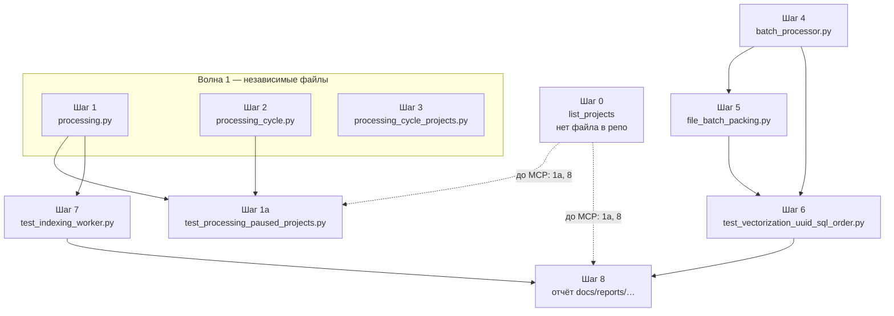

# Карта параллелизации: план «воркеры — сначала свежие файлы»

Связанные документы: [README.md](./README.md), [steps/README.md](./steps/README.md) (описание шагов по файлам), [step_descriptions_1-8_orchestrated.md](./step_descriptions_1-8_orchestrated.md), отчёт [../../reports/2026-04-30-vectorizer-indexer-queue-priority-analysis.md](../../reports/2026-04-30-vectorizer-indexer-queue-priority-analysis.md).

**Аудит:** основная реализация по шагам **1–7** в текущем дереве уже выполнена; граф волн ниже описывает **исходную** стратегию параллелизации при разработке. Для нового PR по этому плану обычно достаточно **0** (верификация `project_id`), **1a** и/или **8** (см. раздел «Статус» в [README.md](./README.md)).

Здесь две оси: **(A) параллелизация работ по шагам плана** (разные файлы / агенты) и **(B) параллелизация во время работы сервера** (процессы воркеров и общие ресурсы).

---

## A. Разработка и CI: какие шаги можно вести параллельно

Правило плана: **1 файл кода = 1 шаг**. Параллелизм возможен, когда **нет общего файла** и **нет логической зависимости «сначала B, потом C»**.

### A.0 Шаг 0 — предусловие (не конфликт по файлам)

- **Шаг 0:** `list_projects` → подтверждение **`project_id`** ([steps/00-verification-list_projects.md](./steps/00-verification-list_projects.md)).
- **Git/PR:** не блокирует параллельные ветки на шагах **1–7** (разные пути в репозитории).
- **Работа через сервер (MCP):** выполнять **до** правок по шагам **1a** и **8** (CST, `universal_file_replace`, `read_project_text_file` и т.д.) — иначе риск неверного `project_id`.

### A.1 Граф зависимостей по файлам (шаги 0–8)

**Легенда:** сплошные стрелки — зависимость по коду или смыслу тестов; пунктир от **0** — обязательный порядок **только** для сценария правок через code-analysis-server, не для чисто локального `git` по шагам 1–7.

| Волна | Шаги | Описание шага (файл) | Комментарий |
|--------|------|----------------------|-------------|
| **0** | 0 | [steps/00-verification-list_projects.md](./steps/00-verification-list_projects.md) | Предусловие для MCP; с PR по коду 1–7 не конфликтует. |
| **1** | 1, 2, 3 | [01](./steps/01-code_analysis-core-indexing_worker_pkg-processing.md), [02](./steps/02-code_analysis-core-vectorization_worker_pkg-processing_cycle.md), [03](./steps/03-code_analysis-core-vectorization_worker_pkg-processing_cycle_projects.md) | Три разных пакета; конфликтов по файлам нет. Продуктово смысл согласован (свежесть по `files.updated_at`). |
| **2** | 1a | [01a](./steps/01a-tests-test_processing_paused_projects.md) | После фиксации текста **`INDEXING_PROJECT_DISCOVERY_SQL`** (шаг 1) и/или **`PROJECTS_PENDING_SQL`** (шаг 2). |
| **3** | 4 | [04](./steps/04-code_analysis-core-vectorization_worker_pkg-batch_processor.md) | Только `batch_processor.py`; не блокирует 1–3, **блокирует** шаг 5. |
| **4** | 5 | [05](./steps/05-code_analysis-core-vectorization_worker_pkg-file_batch_packing.md) | Зависит от шага 4 (`file_table` / `updated_at`). |
| **5** | 6 | [06](./steps/06-tests-test_vectorization_uuid_sql_order.md) | Assert’ы на `batch_processor` после шага 4; цепочка **4 → 5 → 6** для линии «батч + packing». |
| **6** | 7 | [07](./steps/07-tests-test_indexing_worker.md) | Зависит от шага 1. Может идти **параллельно** с волнами 3–5 при разнесении по PR. |
| **7** | 8 | [08](./steps/08-docs-reports-2026-04-30-vectorizer-indexer-queue-priority-analysis.md) | Отчёт после стабилизации кода (1–6 и при необходимости 7); при записи через сервер — после шага **0**. |

### A.2 Матрица «кто с кем параллелен»

Строка **0** — не про конфликт файлов в git: шаг 0 **обязателен перед** работой через сервер над шагами **1a** и **8** (пунктир на схеме A.1). С остальными шагами по отдельным файлам шаг 0 **не мешает** параллельному планированию PR.

|  | **0** | 1 | 2 | 3 | 4 | 5 | 6 | 7 | 1a | 8 |
|--|:---:|:---:|:---:|:---:|:---:|:---:|:---:|:---:|:---:|:---:|
| **0** | — | ✓ | ✓ | ✓ | ✓ | ✓ | ✓ | ✓ | ✓ | ✓ |
| **1** | ✓ | — | ✓ | ✓ | ✓ | | | | после | |
| **2** | ✓ | ✓ | — | ✓ | ✓ | | | | после | |
| **3** | ✓ | ✓ | ✓ | — | ✓ | | | | | |
| **4** | ✓ | ✓ | ✓ | ✓ | — | после | после | ✓ | после 1/2 | |
| **5** | ✓ | ✓ | ✓ | ✓ | после | — | после | ✓ | | |
| **6** | ✓ | ✓ | ✓ | ✓ | после | после | — | ✓ | | |
| **7** | ✓ | после | ✓ | ✓ | ✓ | ✓ | ✓ | — | | |
| **1a** | MCP† | после | после | ✓ | ✓ | ✓ | ✓ | ✓ | — | |
| **8** | MCP† | после кода | после кода | после кода | после | после | после | после | после | — |

**Условные обозначения:** ✓ — можно вести параллельно в разных ветках/PR без конфликта по файлу; «после» — порядок или ожидание merge по коду/смыслу. **MCP†** — для исполнения этого шага через сервер сначала выполнить **шаг 0**; на уровне git-веток шаг 0 с шагами 1–7 **не конкурирует** (нет общего файла).

### A.3 Практические «дорожки» для субагентов

- **Дорожка Indexing:** [1](./steps/01-code_analysis-core-indexing_worker_pkg-processing.md) → ( [1a](./steps/01a-tests-test_processing_paused_projects.md) по SQL discovery ) → [7](./steps/07-tests-test_indexing_worker.md) → фрагмент [8](./steps/08-docs-reports-2026-04-30-vectorizer-indexer-queue-priority-analysis.md) про индексатор.
- **Дорожка Vectorization (цикл и проекты):** [2](./steps/02-code_analysis-core-vectorization_worker_pkg-processing_cycle.md) → ( [1a](./steps/01a-tests-test_processing_paused_projects.md) по `PROJECTS_PENDING_SQL` ) → [3](./steps/03-code_analysis-core-vectorization_worker_pkg-processing_cycle_projects.md); пересечение с дорожкой batch только через merge в `main`.
- **Дорожка Batch / packing / тесты UUID:** [4](./steps/04-code_analysis-core-vectorization_worker_pkg-batch_processor.md) → [5](./steps/05-code_analysis-core-vectorization_worker_pkg-file_batch_packing.md) → [6](./steps/06-tests-test_vectorization_uuid_sql_order.md) → фрагмент [8](./steps/08-docs-reports-2026-04-30-vectorizer-indexer-queue-priority-analysis.md) про векторизатор и чанки.

**Максимальный параллелизм разработки:** до **трёх** независимых PR на волне 1 (шаги 1, 2, 3); затем осознанно **одна** линия на `batch_processor` + `file_batch_packing` + тест шага 6. Перед **1a** / **8** через сервер — [шаг 0](./steps/00-verification-list_projects.md).

---

## B. Рантайм: процессы воркеров и общие ресурсы

### B.1 Процессы

| Компонент | Модель | Параллельность с другими |
|-----------|--------|---------------------------|
| **Database driver** | отдельный жизненный цикл | Общая точка входа к БД для RPC/воркеров. |
| **Indexing worker** | `multiprocessing.Process` | **Параллельно** с векторизатором и file watcher как отдельный OS-процесс. |
| **Vectorization worker** | отдельный процесс | **Параллельно** с индексатором; в коде зафиксировано: индексатор желательно **раньше по запуску**, чтобы снимать `needs_chunking` до чанкинга векторизатора. |
| **File watcher** | отдельный процесс | **Параллельно**; пишет в БД/очереди событий, конкурирует по БД с индексатором/векторизатором. |

Итого: **три воркера + драйвер** работают **конкурентно** на уровне ОС; порядок **старта** в приложении: сначала индексатор, затем векторизатор (см. `worker_lifecycle`, `main_workers_run`).

### B.2 Общие узкие места (не «параллельно без оговорок»)

| Ресурс | Эффект |
|--------|--------|
| **Одна БД** | Запросы из процессов сериализуются движком СУБД; приоритеты **ORDER BY** в SQL влияют на справедливость очередей, а не на истинный SMP-параллелизм записи. |
| **Lease / activity по проекту** | Индексатор и векторизатор могут упираться в **взаимное исключение** по проекту (`worker_project_activity` и аналоги) — параллелизм **между проектами** выше, чем **внутри одного** проекта в один такт. |
| **FAISS / файлы индексов** | Операции пересборки привязаны к векторизатору; порядок rebuild **не** выводится из `PROJECTS_PENDING_SQL` (см. step_descriptions шаг 2). |

### B.3 Внутри одного воркера

Цикл обработки в каждом процессе, как правило, **последовательный** (один батч за раз на проект/цикл). Параллелизм **между** циклами — за счёт poll interval и отдельного процесса векторизатора рядом с индексатором, а не за счёт многопоточного батча внутри одного `process_cycle` (если в коде явно не добавлен пул — в рамках этого плана не предполагается).

---

## C. Сводка для планирования спринта

0. **Перед MCP-правками:** [шаг 0](./steps/00-verification-list_projects.md) (`list_projects` → валидный `project_id`).
1. **День 1 (параллельно):** PR на шаги **1**, **2**, **3** (три ревьюера или три ветки → merge по очереди без склейки в один коммит, если соблюдается «1 файл = 1 шаг»).
2. **После merge 1+2:** PR **1a** (тест SQL-строк; через сервер — только после п.0).
3. **Параллельно с 1a/7:** PR **4**, затем цепочка **5 → 6**.
4. **После стабилизации:** **7** (если ещё не сделан), затем **8** (отчёт; через сервер — после п.0).

---

## D. Вне scope этой карты

- Семантика записи `updated_at`, file watcher, отдельное обновление `VECTORIZATION_BATCHING_ALGORITHM.md` — не меняют саму карту шагов 1–8, но могут добавить **новые** зависимые задачи.
- Горизонтальное масштабирование **нескольких** экземпляров одного типа воркера на одну БД — отдельный дизайн (блокировки, шардирование); в текущей архитектуре — **один процесс на тип воркера** на деплой по типичному пути `WorkerLifecycleManager`.
