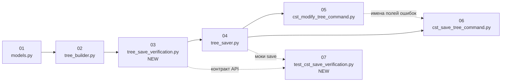

# Карта параллелизации: CST save safety (снимок диска + replay + readback)

Связанные документы: [README.md](./README.md), [steps/README.md](./steps/README.md), пошаговые спецификации в [steps/](./steps/).

Здесь две оси: **(A) разработка и CI** — какие шаги плана можно вести параллельно в разных ветках; **(B) рантайм** — конкуренция запросов к одному файлу/дереву на сервере.

---

## A. Разработка: граф зависимостей (шаги 01–07)

Правило плана: **1 шаг = 1 файл кода** ([steps/README.md](./steps/README.md)). Параллелизм возможен, когда **нет зависимости по merge** и **нет одного общего файла** в двух шагах.

### A.1 Граф (строгие зависимости по коду)

**Легенда:** сплошная стрелка — «после merge родителя»; пунктир — мягкая зависимость (согласование контракта / тестов без общего файла с родителем).

### A.2 Волны merge (максимальный безопасный параллелизм)

| Волна | Шаги | Файлы | Комментарий |
|-------|------|--------|---------------|
| **W1** | **01** | [`models.py`](../../../code_analysis/core/cst_tree/models.py) | Только dataclass; блокирует всех. |
| **W2** | **02** | [`tree_builder.py`](../../../code_analysis/core/cst_tree/tree_builder.py) | После W1. |
| **W3** | **03** | `tree_save_verification.py` (новый) | После W2; не трогает saver/commands. |
| **W4** | **04** | [`tree_saver.py`](../../../code_analysis/core/cst_tree/tree_saver.py) | После W3. |
| **W5** | **05** ∥ **06** | [`cst_modify_tree_command.py`](../../../code_analysis/commands/cst_modify_tree_command.py), [`cst_save_tree_command.py`](../../../code_analysis/commands/cst_save_tree_command.py) | **Два разных файла** — два PR/агента **параллельно после merge W4**, если заранее зафиксированы строковые коды ошибок (`FILE_CHANGED_SINCE_LOAD`, `CST_REPLAY_MISMATCH`, `WRITE_VERIFY_FAILED`) в общем комментарии к epic или в черновике ответа saver. Иначе последовательно: **05 → 06** (меньше конфликтов в текстах `details`). |
| **W6** | **07** | `tests/test_cst_save_verification.py` (новый) | Можно начинать **после merge W3** на ветке, которая подтягивает 03–04; доработать assert’ы после W5–W6. Полностью зелёный CI — после merge всей цепочки до W6. |

### A.3 Матрица «можно ли вести шаг столбца параллельно со шагом строки»

✓ = разные файлы и нет обязательного порядка merge по графу выше; **после** = дождаться merge шага строки перед началом столбца (или согласовать API заранее).

|  | **01** | **02** | **03** | **04** | **05** | **06** | **07** |
|--|:---:|:---:|:---:|:---:|:---:|:---:|:---:|
| **01** | — | после | после | после | после | после | после |
| **02** | после | — | после | после | после | после | после |
| **03** | после | после | — | после | после | после | после† |
| **04** | после | после | после | — | после | после | после† |
| **05** | после | после | после | после | — | ✓* | ✓* |
| **06** | после | после | после | после | ✓* | — | ✓* |
| **07** | после | после | после† | после† | ✓* | ✓* | — |

\* **05 ∥ 06:** только если коды ошибок и формат `SaveVerificationError` уже зафиксированы в 03–04; иначе **06 после 05**.  
† **07 параллельно 03–04:** возможен **ранний** PR с тестами на чистые функции из шага 03; тесты, дергающие `save_tree_to_file`, — после merge **04**.

### A.4 Практические дорожки для субагентов

- **Дорожка «ядро» (линейная):** [01](./steps/01-code_analysis-core-cst_tree-models.md) → [02](./steps/02-code_analysis-core-cst_tree-tree_builder.md) → [03](./steps/03-code_analysis-core-cst_tree-tree_save_verification.md) → [04](./steps/04-code_analysis-core-cst_tree-tree_saver.md).
- **Дорожка «MCP-команды» (до 2 PR):** после merge ядра: [05](./steps/05-code_analysis-commands-cst_modify_tree_command.md) и [06](./steps/06-code_analysis-commands-cst_save_tree_command.md) — параллельно при зафиксированном контракте ошибок; иначе одна ветка 05→06.
- **Дорожка «тесты»:** [07](./steps/07-tests-test_cst_save_verification.md) — черновик сразу после **03**; финализация после **04**; подправка после **05–06**.

**Максимальный параллелизм разработки:** **2** ветки на волне W5 (05 и 06) + опционально ветка тестов 07 против W3–W4 при дисциплине контрактов.

---

## B. Рантайм: сервер и CST-деревья

### B.1 Один файл на диске

| Механизм | Эффект |
|----------|--------|
| [`file_lock`](../../../code_analysis/core/file_lock.py) внутри [`save_tree_to_file`](../../../code_analysis/core/cst_tree/tree_saver.py) | Два одновременных `cst_save_tree` / save из `cst_modify_tree` на **один и тот же путь** сериализуются; не даёт гонки байтов при `os.replace`. |
| Проверка «диск vs снимок» (план шагов 02–04) | Даже под lock внешнее изменение **до** входа в save отсекается; параллельный редактор в другом процессе → отказ с `FILE_CHANGED_SINCE_LOAD`. |

### B.2 Разные `tree_id` / разные файлы

| Ситуация | Параллельность |
|----------|----------------|
| Разные проекты / разные `file_path` | Запросы **параллельны** на уровне приложения; узкое место — общая БД и RPC после записи (как сейчас). |
| Один и тот же файл, два `tree_id` (два load) | Оба дерева в `_trees`; запись и lock на **путь файла** всё равно сериализуются; логически опасно — снимки могут разойтись; это продуктовый риск вне объёма плана, но lock предотвращает порчу байтов. |

### B.3 Replay во время запроса

Replay создаёт временное дерево в `_trees` и должен вызывать `remove_tree` ([шаг 03](./steps/03-code_analysis-core-cst_tree-tree_save_verification.md)) — длительность удлиняет критический участок под `file_lock`. Параллелизм **с другими файлами** не страдает; с тем же файлом — уже сериализовано lock’ом.

---

## C. Сводка для спринта

1. **Merge W1–W4** строго по порядку (01→02→03→04).
2. **W5:** либо один PR **05→06**, либо два PR **05** и **06** параллельно при зафиксированных кодах ошибок.
3. **W6:** довести **07** после стабилизации API 03–04; прогнать полный `pytest` по затронутым тестам.

---

## D. Ссылки на шаги (копируемый список)

- [01 models](./steps/01-code_analysis-core-cst_tree-models.md)
- [02 tree_builder](./steps/02-code_analysis-core-cst_tree-tree_builder.md)
- [03 verification NEW](./steps/03-code_analysis-core-cst_tree-tree_save_verification.md)
- [04 tree_saver](./steps/04-code_analysis-core-cst_tree-tree_saver.md)
- [05 cst_modify_tree](./steps/05-code_analysis-commands-cst_modify_tree_command.md)
- [06 cst_save_tree](./steps/06-code_analysis-commands-cst_save_tree_command.md)
- [07 tests NEW](./steps/07-tests-test_cst_save_verification.md)
