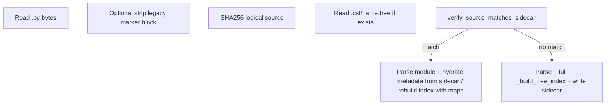

# План: sidecar `.cst/*.tree` вместо блока в исходнике

## Текущее состояние (кратко)

- **Хвост файла:** [`node_id_markers.py`](code_analysis/core/cst_tree/node_id_markers.py) — `strip_persisted_node_ids` / `append_persisted_node_ids` (path → `node_id`).
- **Стабильные id на диске в `.py`:** [`node_id_inline.py`](code_analysis/core/cst_tree/node_id_inline.py) — `# @node-id:` в `leading_lines` у `FunctionDef`/`ClassDef`; при загрузке снимается в метаданные, при сохранении — восстанавливается ([`tree_saver.py`](code_analysis/core/cst_tree/tree_saver.py)).
- **Загрузка:** [`tree_builder.py`](code_analysis/core/cst_tree/tree_builder.py) — `load_file_to_tree`, `create_tree_from_code`, `reload_tree_from_file`, `rollback_tree_to_code` все используют `strip_persisted_node_ids` + `_build_tree_index`.
- **Сохранение:** только [`tree_saver.py`](code_analysis/core/cst_tree/tree_saver.py) дописывает хвост (плюс отключение для файлов под установленным пакетом `code_analysis`).
- **Прочие читатели хвоста:** [`cst_query/index_builder.py`](code_analysis/cst_query/index_builder.py), косвенно через `create_tree_from_code` — всё нужно перевести на один API.

## Целевая модель файлов

- **Имя каталога кеша:** только **`.cst`** (не `.cct`, не кириллица в суффиксе).
- Для файла `{dir}/{name}.py` sidecar: **`{dir}/.cst/{name}.tree`** (аналогично «кешу в каждом каталоге», как `__pycache__`). Каталог **`.cst` создавать при первой записи** (и при необходимости при чтении — если решите создавать пустой каталог заранее, это опционально).
- **Содержимое `.tree` (версионируемый формат):**
  1. Первая строка (или небольшой заголовок): **алгоритм + hex контрольной суммы** исходного **логического** `.py` (рекомендация: **SHA-256 от UTF-8 байтов того же текста, что парсится** — т.е. после удаления устаревшего хвоста `# cst-node-ids`, если он ещё встретится при миграции).
  2. Тело: **JSON** (или JSON после заголовка) с полями минимум: `version`, `source_sha256`, `root_node_id`, `metadata_map` (сериализация [`TreeNodeMetadata.to_dict`](code_analysis/core/cst_tree/models.py)), `parent_map`, при необходимости `node_id_aliases`, поля снимка диска как сейчас у `CSTTree`.
- **Запись атомарная:** писать во временный файл в том же `.cst` и `os.replace`, по аналогии с `.py.tmp`.

## Новые модули / методы (пункты 6–7)

Вынести в отдельный модуль, например [`code_analysis/core/cst_tree/tree_sidecar.py`](code_analysis/core/cst_tree/tree_sidecar.py) (имя на усмотрение):

| Метод | Назначение |
|--------|------------|
| `sidecar_path_for_py(py_path: Path) -> Path` | `{py.parent}/.cst/{py.stem}.tree` |
| `verify_sidecar_against_source(logical_source: str, sidecar: dict) -> bool` | Сравнение сохранённой и вычисленной SHA-256 (п. 6) |
| `load_or_build_cst_tree(...)` | Единая точка: прочитать `.py`, прочитать sidecar, верификация, либо полный build + запись sidecar; вернуть **`CSTTree`** уже зарегистрированный в `_trees` (п. 7 «прозрачно для команд») |

Внутри **`load_or_build_cst_tree`** после `libcst.parse_module`:

- Если верификация **успешна:** не опираться на хвост в `.py`; восстановить состояние из sidecar. Практичный путь без pickle LibCST: **заполнить `metadata_map` / `parent_map` / `root_node_id` из JSON** и **пересобрать `node_map`** обходом дерева с сопоставлением узлов существующей логике (по `path_indices` / `build_marker_path` как сейчас для `persisted_node_ids`, либо по позициям + типу — зафиксировать один канонический ключ в формате sidecar). При несовпадении структуры после parse — считать sidecar недействительным и идти в ветку полного rebuild.
- Если верификация **неуспешна** или файла нет: текущий путь `_build_tree_index` (+ миграция со старым хвостом/inline), затем **запись sidecar**.

**Важно:** полностью **убрать запись** `append_persisted_node_ids` в тело `.py`; **чтение** хвоста оставить ограниченное время для **обратной совместимости** (один раз при загрузке: если есть legacy-блок, не писать его обратно после save — только sidecar).

## Пункты 8–10 (идентификаторы и «данные»)

- **Смысл «данные» на диске:** переносится с **комментариев в `.py`** и **хвоста** на **поля в `.tree`** (`node_id`, `stable_id` и связь с узлом — через path или сохранённые координаты/qualname в JSON).
- **Структурные модификации (как сейчас):** в [`tree_modifier.py`](code_analysis/core/cst_tree/tree_modifier.py) после операций вызывается `_build_tree_index` с `previous_metadata_map` / `previous_obj_to_id` — этот механизм **сохранить**; он и есть «перенос идентичности через перестройку индекса».
- **Сохранение на диск:** в [`tree_saver.py`](code_analysis/core/cst_tree/tree_saver.py) вместо восстановления `# @node-id` в исходник для персистенции — **писать идентификаторы в sidecar**; опционально **перестать вставлять `# @node-id` в `.py`** (или оставить под флагом совместимости на один релиз). Модуль в памяти по-прежнему «чистый» после `strip_inline_stable_ids` после загрузки.
- **Чтение:** из sidecar загрузить `stable_id`/`node_id` в `TreeNodeMetadata`; не требовать комментариев в `.py` для новых проектов.

## Где менять вызовы (п. 2 и 7)

- **Обязательно перевести на `load_or_build_cst_tree` (или расширенный `load_file_to_tree`):**
  - [`cst_load_file_command.py`](code_analysis/commands/cst_load_file_command.py)
  - [`tree_builder.py`](code_analysis/core/cst_tree/tree_builder.py) — `reload_tree_from_file`, `rollback_tree_to_code`, `create_tree_from_code` (добавить опциональный `write_sidecar: bool = True` для путей, которые только парсят без записи)
  - RPC: [`rpc_handlers_ast_cst_query.py`](code_analysis/core/database_driver_pkg/rpc_handlers_ast_cst_query.py), [`rpc_handlers_cst_modify.py`](code_analysis/core/database_driver_pkg/rpc_handlers_cst_modify.py), [`rpc_handlers_ast_modify.py`](code_analysis/core/database_driver_pkg/rpc_handlers_ast_modify.py)
  - [`cst_query/index_builder.py`](code_analysis/cst_query/index_builder.py) / [`query_cst_command.py`](code_analysis/commands/query_cst_command.py) — единая загрузка
  - **Индексатор / sync:** [`file_tree_sync.py`](code_analysis/core/database/file_tree_sync.py), [`update_indexes_entities.py`](code_analysis/commands/update_indexes_entities.py), [`database/files/atomic.py`](code_analysis/core/database/files/atomic.py) — чтобы снимок `file_tree_snapshot_*` совпадал с тем же кешем идентичностей, что и у CST-команд.

- **Запись sidecar после успешного сохранения `.py`:** в [`tree_saver.py`](code_analysis/core/cst_tree/tree_saver.py) после атомарной записи исходника и обновления `disk_source_sha256` — записать `.tree` с тем же SHA-256 и актуальными maps (порядок: согласовать с вашим п. 3–4 из ТЗ: сначала стабильная запись `.py`, затем checksum + сериализация дерева в `.tree`).

## Политика для установленного пакета `code_analysis`

Сейчас хвост не пишется в файлы пакета. Для sidecar: **либо** не создавать `.cst` под site-packages/репо-пакетом, **либо** разрешить (кеш только на диске разработчика). Зафиксировать одно поведение в коде (рекомендация: **не писать sidecar** для путей под `code_analysis` package root, как и раньше для маркеров).

## Документация и git

- Рекомендация в [`docs/`](docs/) (коротко): добавить `.cst/` в `.gitignore` шаблон для проектов-клиентов **или** коммитить кеш — на выбор политики репозитория (в плане реализации: не навязывать, описать в релиз-нотах).

## Тесты

- Юнит-тесты: верификация SHA, миграция «файл с legacy-хвостом → после save только sidecar», reload после modify, согласованность индексатора и `load_file_to_tree` для одного и того же файла.

## Риски

- Формат sidecar и сопоставление узлов при «cache hit» должны быть строго определены; при малейшем расхождении — fallback на полный rebuild (безопасный путь).
- Одновременное редактирование файла вне сервера: SHA не совпадёт — sidecar пересоздаётся (ожидаемо).
